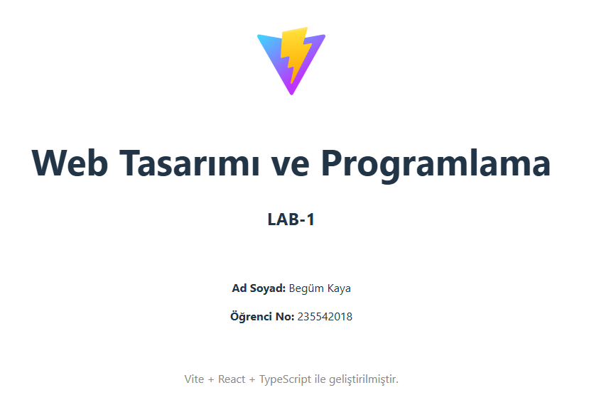

# Web Programlama Projesi

## Hakkında
Bu proje, Web Tasarımı ve Programlama dersi kapsamında Vite + React + TypeScript kullanılarak oluşturulmuştur.

## Geliştirici
- **Ad Soyad:** Begüm Kaya
- **Öğrenci No:** 235542018

## Kullanılan Teknolojiler
- React 18
- TypeScript
- Vite

## Kurulum
Projeyi yerel bilgisayarınızda çalıştırmak için önce bağımlılıkları yükleyin:
```bash
npm install
```

## Çalıştırma
Geliştirme sunucusunu başlatmak için:
```bash
npm run dev
```
Ardından tarayıcıda http://localhost:5173 adresini açarak projeyi görüntüleyebilirsiniz.

## Ekran Görüntüsü

